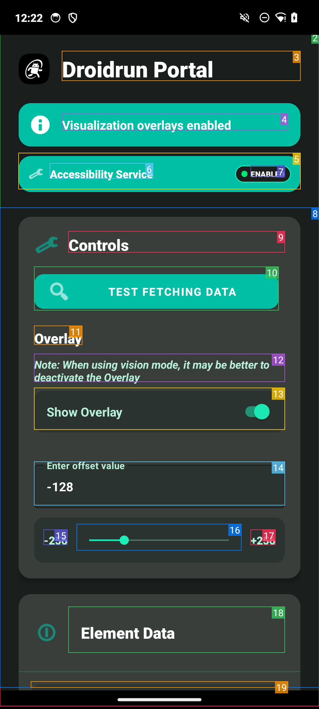

## What is the DroidRun Portal App?

The DroidRun Portal App is an Android application that:

1. Extracts the current UI state of your Android device
2. Communicates this information to the DroidRun framework via ADB
3. Executes commands sent from the DroidRun framework
4. Provides visual feedback about identified UI elements

## How It Works

The Portal App utilizes [Android's Accessibility Services](https://developer.android.com/reference/android/accessibilityservice/AccessibilityService) to:

- Monitor UI changes on your device
- Identify interactive elements (buttons, text fields, etc.)
- Extract text, element positions, and other UI metadata

This information is communicated to the DroidRun framework running on your computer via ADB (Android Debug Bridge), allowing the LLM agent to understand what's on the screen and make informed decisions about how to complete tasks.

### Element Highlighting

You can enable/disable visual highlighting of detected UI elements:

- **Rectangle Overlay**: Draws colored rectangles around UI elements
- **Element Labels**: Shows element IDs or descriptions

These visual indicators help you understand:
- Which elements DroidRun can "see"
- How elements are being categorized
- What information is being sent to the LLM agent

## Privacy and Security

The DroidRun Portal App:

- Only communicates with the DroidRun framework via ADB
- Does not send data to any external servers
- Only activates when being used by the DroidRun framework
- Can be easily disabled through Android settings when not in use

## Installation

The DroidRun Portal App is available from the [DroidRun Portal repository](https://github.com/droidrun/droidrun-portal). For installation instructions, see the [Quickstart](/v3/quickstart) guide.
